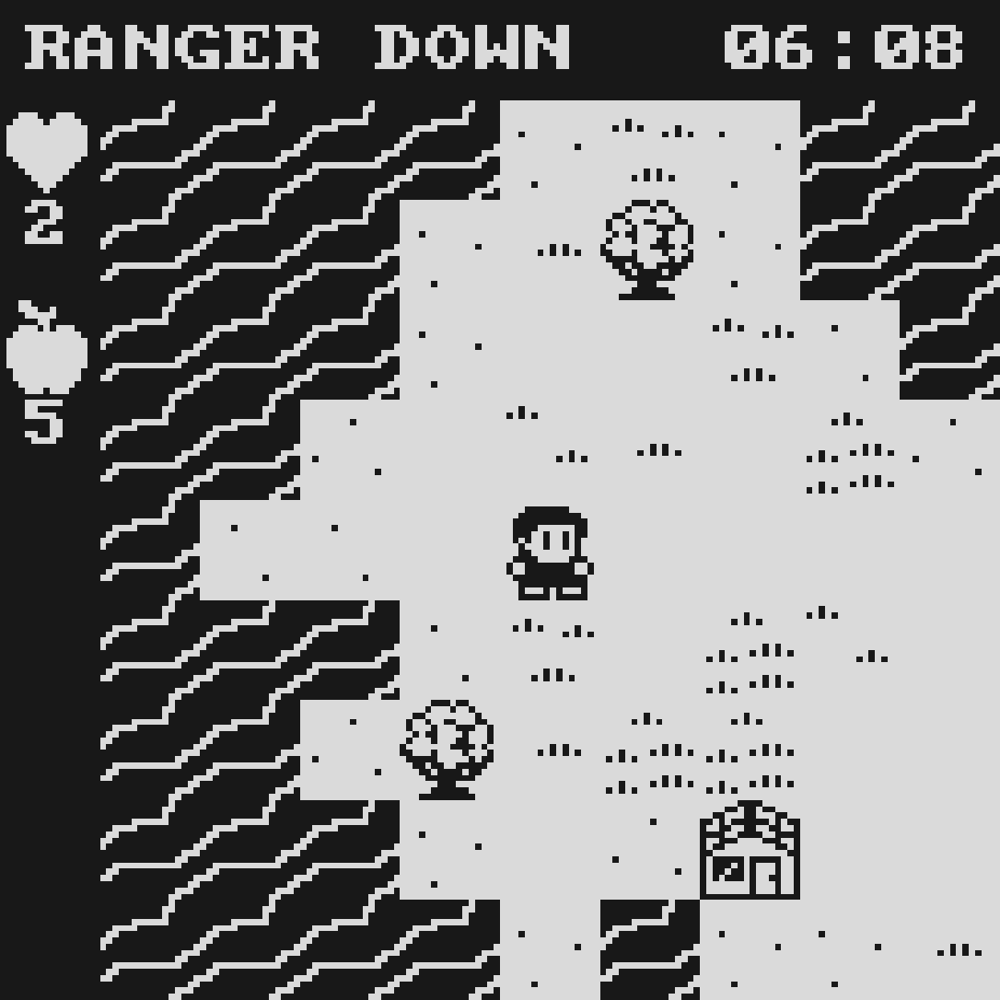
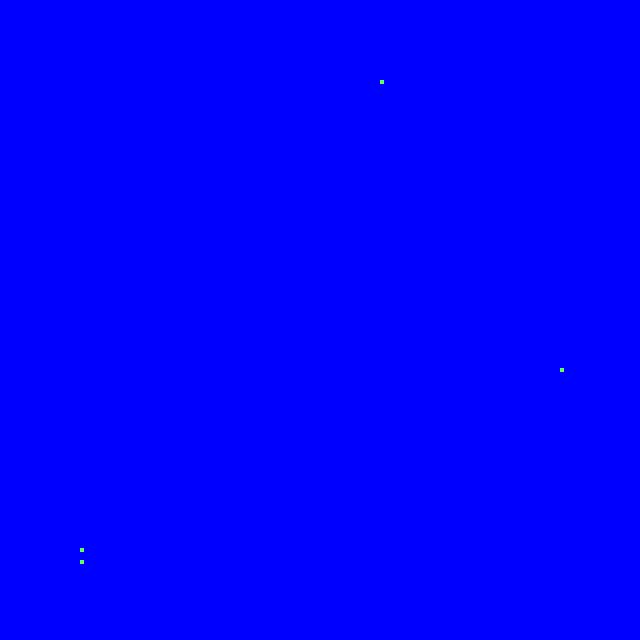

# RANGER DOWN

[Play it here](http://nrkn.com/ranger-down)

A game for [js13kGames 2018 **Offline**](http://2018.js13kgames.com/)

WASD/Arrows + ESC + Space/Enter

Or mouse/touch

## Map Generation

Warning, gameplay spoliers follow.

This GIF is false-colored:

1. Place 4 points along the edges that will bound the island
2. Place a random amount of points within the island - these will be used to 
   place quests
3. Randomly join points that are near to each other until every point is joined.   
   Also join some of the already joined paths to other paths.
   Some paths will close off interior areas from the sea.
4. Make clearings around the quest points
5. Pick random points next to existing land points and add them to the land
   until the landmass reaches the desired size
6. Pick the leftmost land tile - this will be where the player starts.
7. For each of the closed off interior areas, randomly pick one of these biomes
   and fill it with:
   - Forest,
   - Meadow,
   - Mountains, or
   - Lake
8. Decoration step that adds sand around water, randomly places different 
   grass tiles, trees, rocks etc.
9. Clear original paths between quests to an empty land tile, as a visual clue 
   for the user when exploring   
10. Randomly place a different quest at each of the quest locations in the 
    following proportion, and place one of each quest type near to the player 
    start. Make the furthest location from the player the satellite.
    - Ruins 50%
    - Huts 25%
    - Portals 15%
    - None 10%
    

### Log
- ~~pixels scaled as big as possible centered in viewport~~
- ~~draw font to canvas~~
- ~~setup to minify~~
  - Size: 1439, Remaining: 11873
- ~~create art - some grass and tree tiles~~
  - Size: 1730, Remaining: 11582
- ~~create art - a player sprite, two(?) frames animation~~
  - Size: 2070, Remaining: 11242
- ~~generate a map with grass placed randomly, some trees~~
  - Size: 2160, Remaining: 11152
- ~~draw map~~
  - Size: 2268, Remaining: 11044
- ~~draw player~~
  - Size: 2287, Remaining: 11025
- ~~player animates~~
  - Size: 2325, Remaining: 10987
- ~~player can move around with arrows or tap, trees and edge of map block~~
  - Only implemented keyboard - mouse/touch controls is a luxury we can add
    later
  - Size: 2456, Remaining: 10856
- ~~implement messages~~
  - Size: 2566, Remaining: 10746
- ~~implement day/night cycle~~
  - Size: 2660, Remaining: 10652
- ~~create art - water tiles~~
  - Size: 2820, Remaining: 10492
- ~~proper tile collision code~~
  - Size: 2689, Remaining: 10623
- ~~generate better map~~
  - Size: 2853, Remaining: 10459
- ~~color modes - green and amber~~
  - Size: 2955, Remaining: 10357
- ~~splash screen~~
  - Size: 3672, Remaining: 9640
- ~~bump interactions~~
  - Size: 3688, Remaining: 9624
- ~~computer interface~~
  - Size: 4030, Remaining: 9282
- ~~create art - food icon~~
- ~~create art - health icon~~
- ~~create art - skeleton~~
- ~~food mechanic~~
- ~~health mechanic~~
  - Size: 4219, Remaining: 9093
- ~~touch controls~~
  - Size: 4425, Remaining: 8887
- ~~improve splash~~
  - Size: 4487, Remaining: 8825
- ~~create art - boat~~
  - Size: 4648, Remaining: 8664
- ~~create art - path~~
  - Size: 4743, Remaining: 8569
- ~~refactor~~
  - ~~Size: 4746, Remaining: 8566~~
  - ~~Move all consts together and rename~~
  - ~~Move all lets together and rename~~
  - ~~Extract functions for map generation~~
  - ~~Better maps with waypoints~~
  - ~~Move to typescript with hacked in import inliner~~
  - Size: 4642, Remaining: 8670
- ~~multiple~~
  - ~~create art - hut~~
  - ~~create art - sand~~
  - ~~improve map generation~~
  - Size: 5059, Remaining: 8253
- ~~massive speed optimization~~
  - Size 5251, Remaining: 8061
- ~~create art - monsters~~
  - ~~reinstate touch controls~~
  - Size 5513, Remaining: 7799
- ~~create art - inside hut~~
  - ~~enter and exit huts~~
  - Size: 5819, Remaining: 7493
- ~~reinstate boat~~
  - ~~message if bump boat~~
  - Size: 5903, Remaining: 7409
- ~~monster mechanics~~
  - ~~monsters created and move randomly~~
  - Size: 6147, Remaining: 7165
- ~~blue color mode for night instead of invert~~
  - Size: 6137, Remaining: 7175
- ~~monsters~~
  - ~~monsters can harm player and vice versa~~
  - ~~monsters have chance to move towards player~~
  - ~~BUG: but maybe keep - monsters can move on both x and y axis each turn~~
  - ~~BUG: monsters can move onto player tile!~~
  - Size: 6244, Remaining: 7068
- ~~BUG: monsters and player can harm each other during day!~~
  - Size: 6263, Remaining: 7049
- ~~BUG: food can resurrect you after you die!~~
  - ~~BUG: monsters can kill you in the hut~~
  - Size: 6284, Remaining: 7028
- ~~get computers working again~~
  - Size: 6516, Remaining: 6796
- ~~bed in hut to sleep~~
  - Size: 6675, Remaining: 6637
- ~~hungry message~~
  - Size: 6685, Remaining: 6627
- ~~restart on death~~
  - Size: 6754, Remaining: 6558
- ~~biomes~~
  - ~~BUG: map generation sometimes crashes~~
  - ~~create art - more tiles - rocks, flowers, more trees~~
  - Size: 7941, Remaining: 5371
- ~~ISSUE: map generation sometimes very slow~~
  - ~~create quest art: satellite~~
  - ~~create quest art: portal~~
  - Size: 8057, Remaining: 5255
- ~~get key from dead ranger and message~~
  - Size: 8270, Remaining: 5042
- ~~implement keys and locks on huts~~
  - Size: 8362, Remaining: 4950
- ~~search ruins~~
  - Size: 8487, Remaining: 4825
- - ~~portals spawn extra monsters, fix bugs~~
  - ~~Monsters can't move to a spot where a monster died~~
  - ~~Player can sometimes start blocked in~~
  - ~~Monsters don't move towards player properly~~
  - Size: 8756, Remaining: 4556
- ~~if enough caps, can fix computer~~
  - Size: 8838, Remaining: 4474
- ~~synthesize food once per day~~
  - Size: 8917, Remaining: 4395
- ~~rename caps to chips, new graphic too~~
  - Size: 8197, Remaining: 5115
- ~~can use backups you find to restore various computer functions~~
  - ~~database restore:~~
    - ~~intro to story from RANGER - "was sent to investigate ruins - found strange~~
      ~~technology"~~
    - ~~ghost/portal origin~~
    - ~~how to shut down portals~~
    - ~~how to wipe out the ghosts~~
    - ~~how to get satellite working - note to not call base until ghosts cleared~~
      ~~else the rescue team will get wiped out and you lose~~
  - ~~basic map functionality~~
  - Size: 9328, Remaining: 3984
- ~~map restore:~~
  - ~~show a grid square of map~~
  - ~~map can show location of huts, ruins, satellite etc~~
  - Size: 9511, Remaining: 3801
- ~~instead of ruins taking one hour and sometimes find nothing, distribute~~
  ~~needed amount of items + some padding amongs all ruins, and you always find~~
  ~~something until ruins are empty~~
  - ~~BUG - currentRuins is undefined~~
  - ~~fog of war and/or minimap~~
  - Size: 10560, Remaining: 2752
- ~~BUG - player position on map wrong~~
  - Size: 11313, Remaining: 1999
- ~~Show portals on map~~
  - Size: 11271, Remaining: 2041
- ~~Push correct things to display so you see new notes and new map immediately~~
  - Size: 11282, Remaining: 2030
- ~~Always show current location on map~~
  - Size: 11279, Remaining: 2033
- ~~Nearing the end~~
  - ~~BUG - can sometimes synth food multiple times~~
  - ~~BUG - diagnostics should be up to date~~
  - ~~alter chips to destroy portals~~
  - ~~portal animations at night, clear at day~~
  - ~~show status of huts, ruins, portals etc on map~~
  - Size: 11744, Remaining: 1568
- ~~WINNABLE!~~
  - ~~fix satellite to:~~
    - ~~enable comms to call back to base and win~~
    - ~~if you don't deal with ghosts first, you lose (see above)~~
  - ~~satellite, offline message when bump until working~~
  - ~~satellite animation when working~~
  - ~~win screen~~
  - Size: 12140, Remaining: 1172
- ~~Stop searching if monster nearby~~
  - Size: 12200, Remaining: 1112
- ~~Better splash screen~~
  - Size: 12253, Remaining: 1059
- ~~BUG - you are under attack searching ruins during day~~
  - Size: 12261, Remaining: 1051
- ~~Show water on computer map different to unseen~~
  - Size: 12261, Remaining: 1051
- ~~Computer map improvements~~
  - Size: 12316, Remaining: 996
- ~~BUG - recent change broke map gen~~
  - Size: 12320, Remaining: 992  
